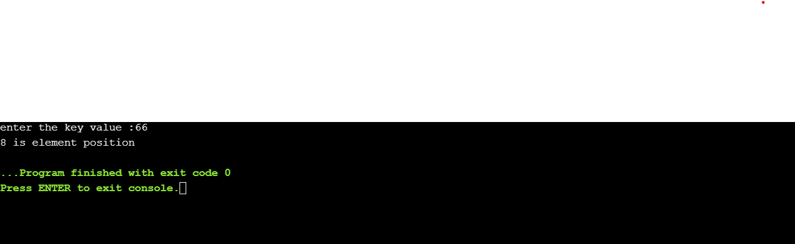
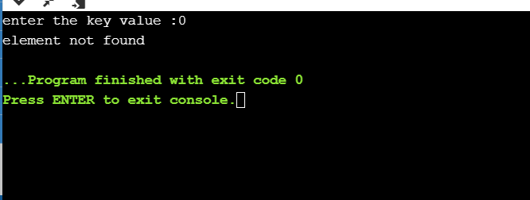

# AIM OF THE EXPERIMENT:  finding a element using linear search with out recursion.

## DESCRIPTION :  Linear search is a very simple search algorithm. In this type of search, a sequential search is made over all items one by one. Every item is checked and if a match is found then that particular item is returned, otherwise the search continues till the end of the data collection.

### STEP BY STEP PROCEDURE:
    1 first declare an array of size 10.
    2 print and scan the key value.
    3 initialise i = 0.
    4 using for loop check the key element with the each element present in array.
    5 if the element present in the array found match with key element then return the index position.
    6 otherwise print "element not found" if the key element does not match with the array elements.

output-1(key element = 66):
we check each element of the given array against the given key element = 66
when the search reaches ninth element,the element in the array matches with key element,hence the search ends here.thus the index(position) of the element is obtained that is equal to 8 .we got required output.

output-2(key element = 0):
we check each element of the given array against the given key element = 0
we didnot found any element which matches with the key element throughout the array.hence the search ends here.the search is unsuccessful as the element not found here.hence it displays that the element is not found.

#### output obtained

