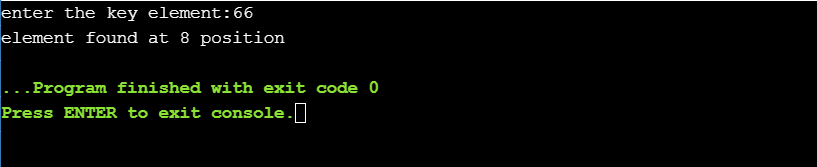
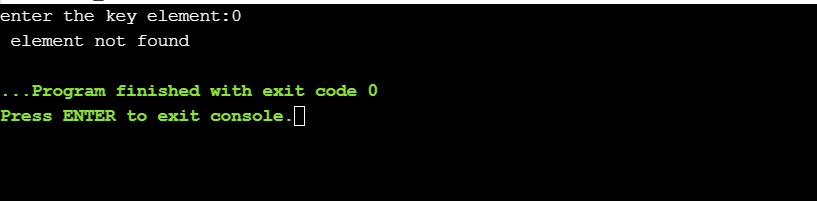

# AIM OF THE EXPERIMENT : finding a element in array using  linear search with recursion.

## DESCRIPTION : Linear search is to find whether an elementis present in array or not.if it present then at what location.

### STEP BY STEP PROCEDURE:
    OUTPUT 1:
    
     1.We have an array{10,6,8,15,20,3,14,99,66,30}.
     2.for output 1 the key element we need to search is 66.
    3.we declare a function recursive_linear search.
    4.we initialise a for loop and check if the eleement is equal to the key value by recursivelu calling the function
    5.when key = element it returns element found with index,if not found it prints element not found.
      here,the index positon of the key element matches with the index of the  array element  at 8 th position.so the position of the key element is 8.
  
    OUTPUT 2: 
      1.We have an array{10,6,8,15,20,3,14,99,66,30}.
      2.for output 2 the key element we need to search is 0.
      3.we declare a function recursive_linear search.
      4.we initialise a for loop and check if the eleement is equal to the key value by recursivelu calling the function
      5.when key = element it returns element found with index,if not found it prints element not found.
      here , the key element does not matches with the elements of array .so the search is unsuccessful it displays element not found. 
      
      
  #### OUTPUT OBTAINED
  
  
  

